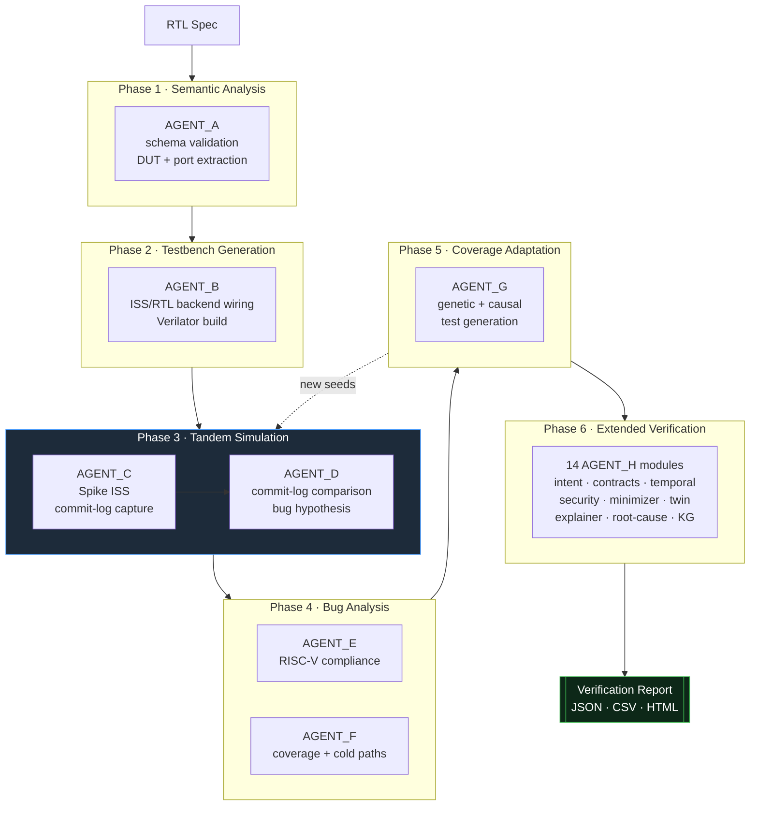
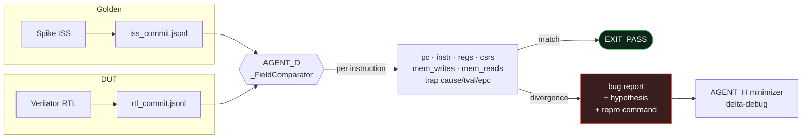
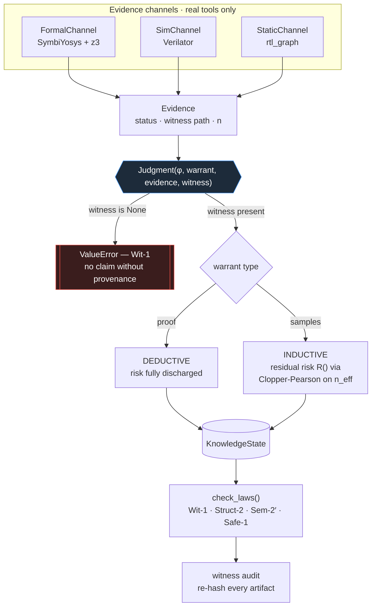
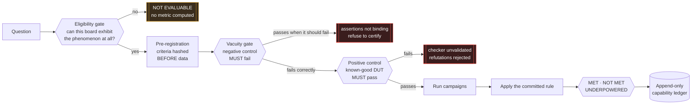

<div align="center">


# AVA — Autonomic Verification Agent

**A multi-agent RISC-V RTL verification platform, and a research track studying whether verification agents can be trusted.**

[](https://github.com/HUNT-001/ai-chip-design-platform/actions/workflows/ci.yml)
[](https://www.python.org/)
[](#testing)
[](LICENSE)
[](https://verilator.org)
[](https://symbiyosys.readthedocs.io)

[Quick Start](#quick-start) · [Architecture](#part-i--ava-the-verification-pipeline) · [VOE Research](#part-ii--voe-the-verification-operating-environment) · [Reproducing Results](#reproducibility) · [Contributing](#contributing)

</div>

---

## What this is

This repository contains two related things.

**AVA** is a verification pipeline. Give it RTL and it runs semantic analysis,
generates a testbench, executes the design against a golden ISS, compares the
two commit logs instruction by instruction, analyses coverage, and generates new
tests aimed at what the campaign has not yet reached. Twelve agents, most of
which run with no EDA toolchain at all.

**VOE** is the research track underneath it, and it asks a harder question: when
an automated agent reports that a design is verified, *why should anyone believe
it?* VOE is built on a small frozen kernel in which a claim cannot exist without
a witness — a real artifact, produced by a real tool, that can be re-checked
later. Every policy change is pre-registered before data is collected and
recorded in an append-only ledger, including the ones that failed.

The two halves share a conviction that the interesting failure in verification
is not the crash. It is the green result that means nothing.

> **Worked example, from this repository's own history.** Four bugs
> ([#1](../../issues/1)–[#4](../../issues/4)) were reported against AVA. None
> was a crash. One made the commit-log comparator — documented as "the sole
> arbiter of pass/fail" — return **PASS** on runs containing real store-data
> corruption. All four had passing tests, because the fixtures were built from
> the implementations rather than the schemas. And CI never ran those tests
> anyway. See [What went wrong, and what it changed](#what-went-wrong-and-what-it-changed).

---

## At a glance

| | |
|---|---|
| **Pipeline agents** | 12 (`AGENT_A` … `AGENT_L`) + 14 extended `AGENT_H` modules |
| **Runs without EDA tools** | Yes — core loop and most agents are pure Python |
| **Real tools when present** | Verilator, Spike ISS, Yosys, SymbiYosys + z3, RISC-V GCC |
| **Test suite** | 1153 passing, 7 skipped, across 9 files (1160 collected) |
| **VOE experiments** | 17 ledger records — 9 promoted, 4 rejected, 2 underpowered, 1 not evaluable, 1 not met |
| **Verification corpus** | 10 design boards, incl. cv32e40p FIFO, Ibex ALU, and two stochastic benchmarks |
| **Python** | 3.10, 3.11, 3.12 |

---

## Demos

Three scripted demos live in [`docs/media/`](docs/media). Each is one command
and needs no EDA toolchain:

| Demo | Command | What it shows |
|---|---|---|
| **Full pipeline** | `vhs docs/media/ava-pipeline.tape` | the six phases running on a sample core |
| **Bug detection** | `vhs docs/media/bug-detect.tape` | the comparator catching store-data corruption that used to read as PASS |
| **Eligibility gate** | `vhs docs/media/voe-eligibility.tape` | VOE **refusing** to report a result, because the board cannot exhibit the effect |

They are kept as scripts rather than checked-in recordings on purpose. A GIF is
a claim about behaviour with no way to re-check it: the tool changes, the output
changes, and the recording keeps showing what the project used to do. A demo you
can run is stronger evidence than one you can only watch — which is the same
argument as the [reproducibility tables](#reproducibility) below.

---

## Table of contents

- [Quick Start](#quick-start)
- [Installation](#installation)
- [Part I — AVA: the verification pipeline](#part-i--ava-the-verification-pipeline)
  - [Pipeline architecture](#pipeline-architecture)
  - [Agent map](#agent-map)
  - [Verification confidence score](#verification-confidence-score)
  - [Command reference](#command-reference)
- [Part II — VOE: the Verification Operating Environment](#part-ii--voe-the-verification-operating-environment)
  - [The kernel](#the-kernel-a-claim-needs-a-witness)
  - [The controls](#the-controls)
  - [The capability ledger](#the-capability-ledger)
  - [Stochastic benchmarks](#stochastic-benchmarks)
- [Reproducibility](#reproducibility)
- [Testing](#testing)
- [What went wrong, and what it changed](#what-went-wrong-and-what-it-changed)
- [Repository layout](#repository-layout)
- [Contributing](#contributing)
- [License](#license)

---

## Quick Start

No EDA toolchain required for any of these.

```bash
git clone https://github.com/HUNT-001/ai-chip-design-platform.git
cd ai-chip-design-platform
pip install -r requirements.txt

# 1. Run the pipeline against an RTL file
python ava_patched.py --rtl path/to/your_core.sv --microarch in_order

# 2. Run the test suite
./run_tests.sh

# 3. Run a VOE experiment in mock mode (no tools needed)
cd voe_bench && python3 run_default_cached.py --mock
```

Expected: the pipeline writes a JSON report under `sim_runs/`, the suite reports
**1153 passed, 7 skipped**, and the VOE runner prints a pre-registration digest
followed by a verdict against the committed rule.

---

## Installation

### Core (pure Python)

```bash
pip install -r requirements.txt
```

That is enough for AGENT_A, D, F, I, K, every `AGENT_H` module, the whole test
suite, and VOE in `--mock` mode.

### Optional EDA tools

Each unlocks specific agents; none is required for the core loop.

| Tool | Unlocks | Install |
|---|---|---|
| **Verilator** ≥ 5.0 | RTL simulation, coverage, the stochastic benchmarks | [verilator.org](https://verilator.org/guide/latest/install.html) |
| **Spike ISS** | Golden-model tandem simulation (AGENT_C) | [riscv-isa-sim](https://github.com/riscv-software-src/riscv-isa-sim) |
| **Yosys + SymbiYosys + z3** | Formal proofs, equivalence checking (AGENT_J, L, VOE formal channel) | [SymbiYosys docs](https://symbiyosys.readthedocs.io) |
| **RISC-V GCC** | Compliance suite, compiled test generation (AGENT_E, G) | `riscv32-unknown-elf-gcc` |

The easiest way to get Verilator, Yosys, SymbiYosys and z3 together is the
[OSS CAD Suite](https://github.com/YosysHQ/oss-cad-suite-build), which is what
this project's results were produced with.

**Graceful degradation is a design property, not an accident.** An agent whose
tool is absent reports that it did not run. It does not silently substitute a
weaker check and report success — that distinction is enforced by the positive
controls described in [The controls](#the-controls).

---

## Part I — AVA: the verification pipeline

### Pipeline architecture



Phases 1–5 are the core loop. Phase 5 feeds back into Phase 3 — coverage gaps
become new stimulus. Phase 6 runs whenever the extended modules are importable.

### The comparator is the arbiter



`interfaces.md` P1 states: *the comparator is the sole arbiter of pass/fail. No
other signal overrides a comparison result.* That makes every field it fails to
read a silent false PASS — which is exactly what [#1](../../issues/1) turned out
to be.

### Agent map

Every module below was verified to exist in this tree.

| Agent | Module | Task | EDA needed |
|---|---|---|---|
| A | `AGENT_A/` | Schema validation, DUT semantic parsing | — |
| B | `AGENT_B/` | RTL/ISS backend wiring, Verilator build | Verilator |
| C | `AGENT_C/` | Spike ISS execution, commit-log capture | Spike |
| D | `AGENT_D/` | Commit-log comparison, bug hypothesis | — |
| E | `AGENT_E/` | RISC-V compliance test runner | GCC + Spike |
| F | `AGENT_F/` | Coverage analysis, cold-path ranking, trend DB | — |
| G | `AGENT_G/` | Genetic + causal test generation | GCC (optional) |
| I | `AGENT_I/` | RVWMO memory-model validator (litmus tests) | — |
| J | `AGENT_J/` | CDC / reset / power checks | Yosys (optional) |
| K | `AGENT_K/` | Microarchitectural performance collector | — |
| L | `AGENT_L/` | RTL→netlist equivalence checking | Yosys + sby |

<details>
<summary><b>The 14 extended AGENT_H modules</b></summary>

| Module | File | Task |
|---|---|---|
| intent | `AGENT_H/agent_h_intent.py` | Architectural intent verification |
| contract | `AGENT_H/contract_dsl.py` | Design contract DSL (`@contract`) |
| temporal | `AGENT_H/temporal_checker.py` | LTL-style temporal property monitors |
| security | `AGENT_H/security_intel.py` | Spectre / privilege / covert-channel detection |
| causal | `AGENT_G/causal_engine.py` | Causal-AI guided test generation |
| minimizer | `AGENT_H/minimizer.py` | Delta-debug counterexample minimisation |
| formal-fuzz | `AGENT_H/formal_fuzzer.py` | SymbiYosys witness → assembly seeds |
| twin | `AGENT_H/digital_twin.py` | Python micro-ISS for fast pre-screening |
| explainer | `AGENT_H/explainer.py` | Human-readable bug explanations |
| root-cause | `AGENT_H/root_cause_localizer.py` | RTL root-cause localisation |
| knowledge-graph | `AGENT_H/knowledge_graph.py` | Cross-campaign verification knowledge graph |
| economics | `AGENT_H/economics_engine.py` | Verification ROI / bugs-per-hour ledger |
| confidence | `AGENT_H/confidence_scorer.py` | Weighted confidence score ∈ [0,1] |
| cross-domain | `AGENT_H/cross_domain.py` | CRYPTO / DMA / UART DUT adapters |
| rtl-graph | `AGENT_H/rtl_graph.py` | RTL netlist graph (also VOE's static channel) |

</details>

### Verification confidence score

| Band | Score | Meaning |
|---|---|---|
| **VERIFIED** | ≥ 0.90 | Ready for sign-off |
| **HIGH** | ≥ 0.70 | Strong evidence, minor gaps |
| **MEDIUM** | ≥ 0.50 | Partial coverage, more testing advised |
| **LOW** | ≥ 0.30 | Significant gaps |
| **CRITICAL** | < 0.30 | Do not tape out |

A score is an aggregate of evidence from agents that actually ran. Agents that
could not run contribute nothing rather than contributing a default.

### Command reference

```bash
# Minimal — no EDA tools
python ava_patched.py --rtl core.sv --microarch in_order

# Disable the extended pipeline (phases 1–5 only)
python ava_patched.py --rtl core.sv --no-extended

# With RTL sources for root-cause localisation
python ava_patched.py --rtl core.sv --rtl-sources src/

# Custom coverage target and timeout
python ava_patched.py --rtl core.sv --target-cov 95 --timeout 3600

# Reproducible run
python ava_patched.py --rtl core.sv --seed 42 --run-dir sim_runs/exp1

# Report formats
python ava_patched.py --rtl core.sv --formats json,csv,html
```

| Flag | Meaning |
|---|---|
| `--rtl` | Path to the RTL file under test |
| `--rtl-sources` | Directory of sources for root-cause analysis |
| `--microarch` | `in_order` \| `out_of_order` |
| `--isa` | RISC-V ISA string (default `rv32im`) |
| `--seed` | Campaign seed — same seed, same campaign |
| `--target-cov` | Coverage target percentage |
| `--timeout` | Wall-clock budget in seconds |
| `--run-dir` | Output directory |
| `--formats` | `json`, `csv`, `html` |
| `--no-llm` | Disable the LLM layer |
| `--no-extended` | Skip Phase 6 |
| `--spike` | Path to the Spike binary |
| `--log-commits` | Emit commit logs |

---

## Part II — VOE: the Verification Operating Environment

> *"The agent isn't the product any more. The organisation is."*

AVA answers *how do we verify this design?* VOE asks the question one level up:
**how do we know the verification itself is sound?** It is built on a frozen
kernel (VSA v1.0) that has not changed while everything above it has.

### The kernel: a claim needs a witness



Three properties do the work:

1. **A witness is mandatory.** `Judgment(φ, warrant, evidence, witness=None)`
   raises. Every claim cites a real file produced by a real tool.
2. **Witnesses are re-hashed, not merely recorded.** A stamp nothing verifies is
   decoration. `audit_knowledge()` re-checks that the artifact cited is still
   the artifact that was cited.
3. **Warrants are typed.** A formal proof discharges risk unboundedly. A
   simulation pass does not — it carries residual risk computed from the
   effective sample count. A bounded model check that passes is strong evidence
   and is *not* labelled a proof.

### The controls

Each control exists because something got past the previous ones.



| Control | Refuses to let you… |
|---|---|
| **Vacuity gate** | issue proofs from assertions that cannot fail |
| **Positive control** | accept refutations from a checker that fails spuriously |
| **Negative control** | trust a reference model that passes on broken RTL |
| **Witness audit** | keep a claim whose evidence has changed |
| **Pre-registration** | choose the success criteria after seeing the data |
| **Eligibility gate** | compute a metric on a board that cannot exhibit the effect |

**`NOT EVALUABLE` is a first-class verdict.** It is not a weak `NOT MET`.
A `NOT MET` says the effect is absent or too small; `NOT EVALUABLE` says the
question was never asked, because the environment could not exhibit the
phenomenon. Conflating them is how a benchmark mismatch gets recorded as a
scientific finding. See [`voe/eligibility.py`](voe/eligibility.py).

### The capability ledger

Append-only, and the failures are the point. A ledger containing only successes
is a marketing document.

| # | Decision | Subject |
|---|---|---|
| 1 | `REJECTED` | H-uncertainty (posteriors + priced value-of-data) |
| 2 | `PROMOTED` | K-multistep |
| 3 | `UNDERPOWERED` | K-multistep |
| 4 | `REJECTED` | L-static-onestep |
| 5 | `PROMOTED` | **M-static-cached** — the current default policy |
| 6 | `REJECTED` | H-uncertainty (reconsideration) |
| 7 | `PROMOTED` | Lemma-decomposed proof |
| 8 | `PROMOTED` | N-lemmafirst |
| 9 | `REJECTED` | H-uncertainty (reconsideration) |
| 10 | `PROMOTED` | mv_filter coupling probe |
| 11 | `PROMOTED` | N-lemmafirst (second design family) |
| 12 | `UNDERPOWERED` | N-lemmafirst on a mixed sim+formal board |
| 13 | `NOT EVALUABLE` | Experiment 15 — no stochastic effect existed in the corpus |
| 14 | `PROMOTED` | sat_mac stochastic benchmark |
| 15 | `PROMOTED` | sat_mac, corrected stimulus |
| 16 | `PROMOTED` | pfifo — second stochastic benchmark |
| 17 | `NOT MET` | Stochastic Generalization Gate |

**9 promoted · 4 rejected · 2 underpowered · 1 not evaluable · 1 not met**

Five attempts to add machinery lost to rules that remove it. The current default
policy, `M-static-cached`, is the simplest thing that ever beat the incumbent:
read each design's structure once, then commit. No posterior, no lookahead, no
learned model.

Record 17 is worth reading in full. It is a **negative result with a
quantitative cause**: a stateful FIFO was expected to produce a
non-memoryless detection curve and did not, because its occupancy chain mixes in
~12 cycles while its rare corner arrives once in ~1556 — a ratio of ~130, so the
state is forgotten many times over between opportunities. Statefulness is not
the variable that produces a distinct stochastic regime; the ratio of mixing
time to rare-event interval is.

### Stochastic benchmarks

Two designs where the same action genuinely *sometimes* catches a bug:

| Board | Design | Mutant | Rarity mechanism |
|---|---|---|---|
| [`voe_stoch/`](voe_stoch) | `sat_mac` — saturating signed MAC | one line: the `(-128)×(-128)` product | memoryless; 1 input pair in 65 536 |
| [`voe_stoch2/`](voe_stoch2) | `pfifo` — depth-6 FIFO with flush-but-first | one line: missing pointer wrap | occupancy walk must sit at the last slot when a rare control event arrives |

Both admitted under a configuration hashed before any campaign ran. `pfifo`'s
measured curve:

| cycles | detections | P(detect) | 95% CI (Clopper-Pearson) |
|---:|---:|---:|---|
| 64 | 0/24 | 0.000 | [0.000, 0.142] |
| 128 | 0/24 | 0.000 | [0.000, 0.142] |
| 256 | 2/24 | 0.083 | [0.010, 0.270] |
| 512 | 8/24 | 0.333 | [0.156, 0.553] |
| 1024 | 11/24 | 0.458 | [0.256, 0.672] |
| 2048 | 15/24 | 0.625 | [0.406, 0.812] |
| 4096 | 21/24 | 0.875 | [0.676, 0.973] |

A **grid** of campaign lengths is committed, not a single chosen length, and the
whole curve is published including the degenerate points. There is no post-hoc
selection available because there is nothing to select. Shrinking the vector
count until a bug is sometimes missed would tune the instrument until the
hypothesis became testable; it was considered, refused, and the refusal is in
the ledger.

---

## Reproducibility

Every headline number above can be re-derived. Tool versions used to produce
them:

| Component | Version |
|---|---|
| Python | 3.10 / 3.11 / 3.12 |
| Verilator | 5.049 |
| Yosys / SymbiYosys | OSS CAD Suite |
| SMT solver | z3 |
| OS | Ubuntu 22.04 / WSL2 |

### Claims and how to check them

| Claim | Command | Expected | Tools |
|---|---|---|---|
| 1153 tests pass | `./run_tests.sh` | `1153 passed, 7 skipped` | none |
| `sat_mac` is a valid stochastic benchmark | `cd voe_stoch && python3 characterise.py --seeds 40` | `ELIGIBLE`, 0 < P(detect) < 1, controls pass | Verilator |
| `pfifo` is a valid stochastic benchmark | `cd voe_stoch2 && python3 characterise.py --seeds 24` | `ELIGIBLE` at 256–4096 cycles, table above | Verilator |
| The two boards are one regime, not two | `cd voe_bench && python3 run_stoch_transfer.py --real --seeds 24` | `ONE REGIME` — gate does not pass | Verilator |
| The shape statistic is calibrated | `cd voe_bench && python3 run_stoch_transfer.py --calibrate` | ~5% false alarm, ~99% power at 24 seeds | none |
| `M-static-cached` beats the incumbent | `cd voe_bench && python3 run_default_cached.py --real --seeds 24` | `MET`, +12.2% | Verilator + sby |
| Lemma-first ordering wins on 2 families | `cd voe_bench && python3 run_coupled_two.py --real --seeds 12` | `MET`, +22.2% | sby + z3 |
| The FIFO coupling is measured, not declared | `cd voe_fifo/formal && sby -f fifo_coupling.sby` | `state_match` PASS, `integrity` UNKNOWN, `integrity_mut` FAIL@7 | sby + z3 |

Every runner prints its pre-registration digest and whether it is `INTACT`
before reporting anything. A modified commitment invalidates the run.

### Things that will *not* reproduce, and why

- **`--mock` mode never characterises a benchmark.** Mock returns a fixed
  verdict by construction, so every curve is flat. The scripts say so and refuse
  to draw conclusions.
- **Seed counts are not sample counts on deterministic boards.** Experiments 13
  and 14 ran one campaign N times; their gains are exact arithmetic, not
  estimates. This is recorded as a limitation, not hidden.
- **The transfer statistic degrades with more seeds.** False-alarm rate rises
  from ~5% at 24 seeds to ~14% at 48, because exact intervals shrink faster than
  a one-parameter fit can track. "Run it with more seeds" is not an available
  response to an ambiguous verdict, and the seed count is committed in advance
  like any other configuration.

### Recording the demos

The GIFs are produced with [vhs](https://github.com/charmbracelet/vhs):

```bash
go install github.com/charmbracelet/vhs@latest   # or: brew install vhs

cd docs/media
vhs ava-pipeline.tape      # -> ava-pipeline.gif
vhs bug-detect.tape        # -> bug-detect.gif
vhs voe-eligibility.tape   # -> voe-eligibility.gif
```

Each `.tape` is a plain-text script, so a demo can be regenerated when behaviour
changes instead of quietly becoming a screenshot of a version nobody runs.

---

## Testing

```bash
./run_tests.sh          # everything — 1153 passed, 7 skipped
make test               # same, via make
make test-full          # includes integration tests
```

`run_tests.sh` disables pytest plugin autoloading and allow-lists what it needs,
then **exits non-zero if no interpreter has `pytest-asyncio`**. Without that,
`tests/test_agents.py`'s async tests degrade to warnings and the suite reports
success having checked nothing.

| Suite | Tests | Covers |
|---|---|---|
| `tests/test_agents.py` | 501 | Core orchestrator, agent wiring |
| `tests/test_extended_agents.py` | 206 | The 14 extended modules |
| `tests/test_failure_memory.py` | 54 | **Permanent adversarial regressions** |
| `tests/test_voe_kernel.py` | 79 | Kernel laws, warrants, pre-registration |
| `tests/test_coverage_pipeline.py` | 6 | Coverage DB, error policy |
| `AGENT_C/test_spike_parser.py` | 67 | Spike log parsing |
| `AGENT_C/test_run_iss_integration.py` | 43 | ISS integration |
| `AGENT_D/test_comparator.py` | 94 | Commit-log comparison |
| `AGENT_E/test_compliance_runner.py` | 110 | RISC-V compliance |

`test_failure_memory.py` is unusual and worth explaining: it does not test what
the system is supposed to do. It tests **what previously worked and was wrong** —
every configuration that produced a confident, plausible, incorrect result. Each
case names its incident. All of them happened.

CI runs every suite on Python 3.10, 3.11 and 3.12, plus a guard step that fails
the build if a `test_*.py` exists which the pytest step does not execute.

---

## What went wrong, and what it changed

Four bugs were reported against this repository. Not one was a crash.

| Issue | Defect | Why CI was green |
|---|---|---|
| [#1](../../issues/1) | Comparator never read canonical `mem_writes` / nested `trap` — returned **PASS** on real store corruption | fixtures built in the flat layout the buggy parser expected |
| [#2](../../issues/2) | Spike parser labelled every store as a load | the test asserted `addr`, never `type` |
| [#3](../../issues/3) | `record()` called with a nonexistent kwarg; `TypeError` swallowed by `except Exception` | the crash *was* the swallowed exception |
| [#4](../../issues/4) | Validator and schema defined disjoint status vocabularies | the fixture used a status valid only under the wrong one |

The common cause: **the test suite agreed with the bug**, because fixtures were
written from the implementation rather than from the schema.

And beneath that, a simpler one — **CI ran a single test file.** 
`test_comparator.py`, `test_spike_parser.py`, `test_extended_agents.py` and four
others never executed on a pull request. All four bugs lived in code whose tests
CI was not running. "CI was green" was true and meaningless.

What changed: canonical-schema fixtures, invariant tests instead of
instance tests, an error policy that distinguishes environment failures from
programming errors, the full suite in CI, and a guard that fails the build if a
test file exists which CI does not run. Thanks to
[@Premchand006](https://github.com/Premchand006), who reported all four with
root causes and reproducers.

---

## Repository layout

```
ai-chip-design-platform/
├── ava_patched.py            # main entry point (AVA orchestrator)
├── ava.py                    # core orchestrator
├── run_tests.sh              # deterministic test entry point
│
├── AGENT_A/ … AGENT_L/       # the 12 pipeline agents
│   ├── AGENT_A/              #   schema validation, DUT extraction
│   │   ├── commitlog.schema.json
│   │   ├── run_manifest.schema.json
│   │   └── interfaces.md     #   the inter-agent contract
│   ├── AGENT_D/              #   the comparator — sole arbiter of pass/fail
│   └── AGENT_H/              #   14 extended verification modules
│
├── voe/                      # VOE kernel and policy layer
│   ├── eligibility.py        #   the gate before all other gates
│   ├── preregistration.py    #   hashed criteria, hashed commitments
│   ├── policy.py             #   policies as data
│   └── binomial.py           #   exact Clopper-Pearson intervals
├── phase3/
│   └── evidence_channels.py  # FormalChannel · SimChannel · StaticChannel
├── voe_bench/                # experiment runners
│   └── capability_ledger.json  #   append-only record of every verdict
├── voe_fifo/ voe_ibex/ …     # verification corpus (10 boards)
├── voe_stoch/ voe_stoch2/    # the two stochastic benchmarks
│
├── corpus/                   # vendored RISC-V cores (submodules)
├── tests/                    # test suites
├── docs/
│   ├── PLATFORM_OVERVIEW_AND_POC.md   # the full VOE record (1597 lines)
│   └── media/                # demo recording scripts
└── .github/workflows/ci.yml
```

---

## Contributing

See [CONTRIBUTING.md](CONTRIBUTING.md) and
[CODE_OF_CONDUCT.md](CODE_OF_CONDUCT.md).

**Bug fixes here follow a two-commit pattern:**

1. A commit adding a test that **fails**, written from the schema or
   specification — not from the code under test.
2. A commit with the fix, turning it green.

A reviewer can then check out the first commit and watch it go red. Given that
all four bugs above shipped with passing tests, "add a test" is not sufficient
on its own: the test has to be *demonstrated* to fail first.

Good places to start are issues labelled
[`good first issue`](../../issues?q=is%3Aissue+is%3Aopen+label%3A%22good+first+issue%22).
Issues labelled `silent-failure` are the ones this project considers most
dangerous — they report success while broken.

---

## License

Apache-2.0 — see [LICENSE](LICENSE).

Vendored cores under `corpus/` retain their own licences (cv32e40p and
`cv32e40p_fifo` are Solderpad-0.51; Ibex, CVA6, BlackParrot and others carry
their upstream terms).
